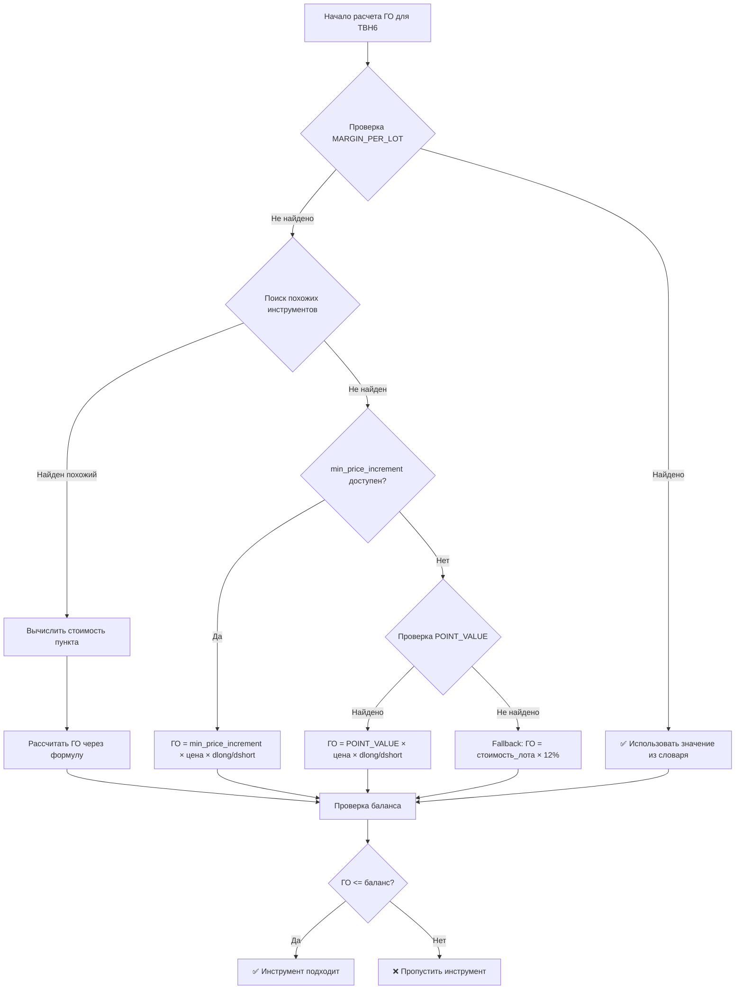

# Пример расчета ГО для TBH6

## Обзор

Демонстрация пошагового расчета гарантийного обеспечения (ГО) для инструмента TBH6 с использованием всех приоритетов алгоритма.

## Схема расчета ГО



---

## Исходные данные (пример)

Предположим, что из API получены следующие данные:

```python
ticker = "TBH6"
current_price = 2500.0  # ₽ (текущая цена)
lot_size = 1.0          # Лотность
api_dlong = 0.15        # Из API (может быть неверным!)
api_dshort = 0.15       # Из API (может быть неверным!)
min_price_increment = 0.1  # Стоимость пункта из API
balance = 5000.0        # ₽ (баланс счета)
```

---

## Пошаговый расчет ГО

### Шаг 1: Проверка словаря MARGIN_PER_LOT

```python
# Проверяем: есть ли TBH6 в словаре?
if "TBH6" in MARGIN_PER_LOT and MARGIN_PER_LOT["TBH6"] > 0:
    margin_per_lot = MARGIN_PER_LOT["TBH6"]
    # ✅ ИСПОЛЬЗУЕМ ЭТО ЗНАЧЕНИЕ
```

**Результат:**
```
❌ Не найдено в словаре MARGIN_PER_LOT
   MARGIN_PER_LOT['TBH6'] = не существует (или 0.0)
```

**Статус:** Пропускаем, переходим к следующему приоритету

---

### Шаг 2: Автоматический расчет из похожих инструментов

```python
# Ищем похожие инструменты по префиксу "TB"
instrument_groups = {
    "TB": ["VBH6"],  # Возможно, TBH6 похож на VBH6?
    # ...
}

# Проверяем группу "TB"
if "TBH6".startswith("TB"):
    # Найдена группа, проверяем VBH6
    if "VBH6" in MARGIN_PER_LOT and MARGIN_PER_LOT["VBH6"] > 0:
        known_margin = MARGIN_PER_LOT["VBH6"]  # Но VBH6 = 0.0 в словаре!
```

**Результат:**
```
❌ Не найдена группа похожих инструментов с известной маржей
   VBH6 в словаре = 0.0 (TODO)
```

**Статус:** Пропускаем, переходим к следующему приоритету

---

### Шаг 3: Расчет через min_price_increment

```python
# Пробуем использовать min_price_increment из API
if min_price_increment > 0:  # 0.1
    # Для LONG:
    margin_long = min_price_increment * current_price * api_dlong
    margin_long = 0.1 * 2500.0 * 0.15 = 37.5 ₽
    
    # Для SHORT:
    margin_short = min_price_increment * current_price * api_dshort
    margin_short = 0.1 * 2500.0 * 0.15 = 37.5 ₽
    
    # Берем максимальную
    margin_per_lot = max(37.5, 37.5) = 37.5 ₽
```

**Результат:**
```
✅ Рассчитана маржа через min_price_increment: 37.5 ₽
   Формула: 0.1 × 2500.0 × 0.15 = 37.5 ₽
```

**Статус:** ⚠️ **РЕКОМЕНДУЕТСЯ проверить в терминале!**

**Проблема:** API значения dlong/dshort могут быть неверными, поэтому результат может быть неточным.

---

### Шаг 4: Расчет через get_margin_for_position (fallback)

Если шаг 3 не сработал, используется fallback:

```python
# Проверяем MARGIN_RATE_PCT
if "TBH6" in MARGIN_RATE_PCT:
    margin_rate = MARGIN_RATE_PCT["TBH6"] / 100.0
else:
    margin_rate = 0.12  # 12% по умолчанию

# Рассчитываем
lot_value = current_price * lot_size = 2500.0 × 1.0 = 2500.0 ₽
margin_per_lot = lot_value * margin_rate = 2500.0 × 0.12 = 300.0 ₽
```

**Результат:**
```
⚠️ Используется fallback расчет:
   Стоимость лота: 2500.0 ₽
   Коэффициент маржи: 12.0% (по умолчанию)
   ГО: 2500.0 × 0.12 = 300.0 ₽
```

**Статус:** ❌ **ОБЯЗАТЕЛЬНО обновить из терминала!**

---

## Итоговый расчет для TBH6

### Сценарий 1: Если min_price_increment доступен

```python
# Исходные данные:
current_price = 2500.0 ₽
min_price_increment = 0.1
api_dshort = 0.15

# Расчет:
margin_per_lot = 0.1 × 2500.0 × 0.15 = 37.5 ₽
```

**Проверка баланса:**
```python
balance = 5000.0 ₽
margin_per_lot = 37.5 ₽

if margin_per_lot <= balance:  # 37.5 <= 5000 ✅
    max_lots = 5000 / 37.5 = 133 лота
```

**Результат:** ✅ Достаточно баланса для открытия 133 лот(ов)

---

### Сценарий 2: Если min_price_increment недоступен (fallback)

```python
# Исходные данные:
current_price = 2500.0 ₽
lot_size = 1.0
margin_rate = 0.12  # 12% по умолчанию

# Расчет:
lot_value = 2500.0 × 1.0 = 2500.0 ₽
margin_per_lot = 2500.0 × 0.12 = 300.0 ₽
```

**Проверка баланса:**
```python
balance = 5000.0 ₽
margin_per_lot = 300.0 ₽

if margin_per_lot <= balance:  # 300.0 <= 5000 ✅
    max_lots = 5000 / 300.0 = 16 лот(ов)
```

**Результат:** ✅ Достаточно баланса для открытия 16 лот(ов)

---

## Важные замечания

### ⚠️ API значения могут быть неверными

**Проблема:**
- API Tinkoff возвращает `dlong`/`dshort`, которые **НЕ соответствуют реальной марже**
- Для NGG6: API dlong = 0.33 ₽, но реальная маржа = 7 667,72 ₽
- Для PTH6: API dlong = 0.2834 ₽, но реальная маржа = 33 860,23 ₽

**Решение:**
- Используйте значения из терминала Tinkoff
- Добавьте в словарь `MARGIN_PER_LOT` в `bot/margin_rates.py`

### ✅ Рекомендации для TBH6

1. **Проверьте в терминале Tinkoff:**
   - Откройте инструмент TBH6
   - Найдите "Гарантийное обеспечение за лот"
   - Запишите значение

2. **Добавьте в словарь:**
   ```python
   # В bot/margin_rates.py
   MARGIN_PER_LOT = {
       # ...
       "TBH6": 1234.56,  # Значение из терминала
   }
   ```

3. **Проверьте расчет:**
   ```bash
   python find_optimal_instruments.py --balance 5000
   ```

---

## Формулы расчета

### Формула 1: Через min_price_increment

```
ГО = min_price_increment × текущая_цена × dlong/dshort
```

**Пример:**
```
ГО = 0.1 × 2500.0 × 0.15 = 37.5 ₽
```

### Формула 2: Fallback (процент от стоимости)

```
ГО = стоимость_лота × коэффициент_маржи
ГО = (цена × лотность) × коэффициент_маржи
```

**Пример:**
```
ГО = (2500.0 × 1.0) × 0.12 = 300.0 ₽
```

---

## Проверка достаточности баланса

### Логика проверки

```python
# ВАЖНО: Для фьючерсов нужно только ГО
# Стоимость лота НЕ блокируется на счете

# Проверка 1: Достаточно ли ГО для 1 лота?
if margin_per_lot > balance:
    # Пропускаем инструмент
    return None

# Проверка 2: ГО не превышает максимальный процент?
max_margin = balance * (margin_pct / 100.0)  # Например, 25% от баланса
if margin_per_lot > max_margin:
    # Пропускаем инструмент
    return None

# Расчет максимального количества лотов
max_lots = int(balance / margin_per_lot)
```

### Пример для TBH6

```python
# Данные:
balance = 5000.0 ₽
margin_per_lot = 37.5 ₽  # Из расчета через min_price_increment
margin_pct = 25.0  # Максимальный процент от баланса

# Проверка 1:
if 37.5 <= 5000.0:  # ✅ Проходит
    # Проверка 2:
    max_margin = 5000.0 × 0.25 = 1250.0 ₽
    if 37.5 <= 1250.0:  # ✅ Проходит
        max_lots = 5000.0 / 37.5 = 133 лота
```

---

## Вывод результатов

После расчета для TBH6 будет создана запись:

```csv
figi,ticker,name,current_price,lot_size,price_step,lot_value,margin_per_lot,margin_pct_of_balance,max_lots_available,volatility_pct,avg_volume_lots,avg_volume_rub,score,date_analyzed,analysis_period_days
FUT...,TBH6,...,2500.0,1.0,0.1,2500.0,37.5,0.75,133,2.5,1000,2500000,85.0,2026-02-16T...,30
```

**Ключевые поля:**
- `margin_per_lot`: 37.5 ₽ (ГО за лот)
- `margin_pct_of_balance`: 0.75% (ГО в % от баланса)
- `max_lots_available`: 133 (максимум лотов на балансе)

---

## Связанные файлы

- `find_optimal_instruments.py` - основной скрипт
- `bot/margin_rates.py` - функции расчета ГО
- `docs/PRICE_AND_MARGIN_CALCULATION.md` - общая документация
- `docs/MARGIN_DETERMINATION_ALGORITHM.md` - алгоритм определения ГО
